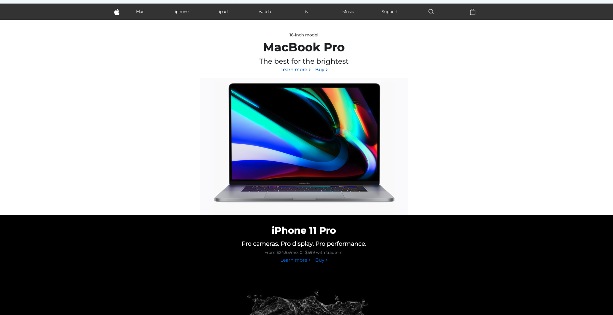

# 🚀 Apple.com Project by 

## Kaleb ~  Habiba ~  Abdella  ~ Barnaf ~ Yohannes

```diff
+ > This project is apple.com website cloning by Evangadi may 2026 students

```


## 🎨 Visual Preview




---

## ✨ Features

- **Header:** 
- **Footer:** 
- **First Section banner:** 
- **Second section banner:**
- **Third Section banner:** 
- **Fouth section left:**
- **Fourth Section right:** 
- **Fouth section left:**
- **Fourth Section right:** 
- **Fouth section left:**
- **Fourth Section right:** 


## 🛠️ Tech Stack

| Category | Technology |
| :--- | :--- |
| **Frontend** | JavaScript, CSS, Boostrap, HTML |
| **Backend** | Node.js, Express|
| **Database** | MySql |
| **DevOps** | GitHub|

---

## 🚀 Getting Started

Follow these simple steps to get a local copy up and running.


### Installation

1. Clone the repository:
   ```bash
   git clone https://github.com/habibaali5/appleClone.git
   ```
   
   ```
   git branch, git add, git status, git commit, git pull , git push
---

## 📜 License

Distributed under the **Group-3 License**. See `EVANGADI.md` for more information.

---

## 📮 Contact

- **KALEB** - kaleb.z.gabriel@gmail.com
- **HABIBA** - habibaalihabibaali6@gmail.com
- **ABDELLA** - abdella@gmail.com
- **YOHANNES** - yohannesmengistu04@gmail.com
- **BARNAF** - barnaf.humnassa@gmail.com
  
- **Project Link:** [Group-3-of-Group-3](https://github.com/habibaali5/appleClone.git)
